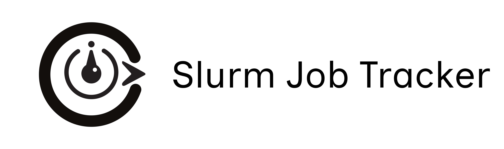

# Slurm Job Tracker



A Python package for tracking and managing Slurm jobs with an HTTP server.

## Features

- Tracks running Slurm jobs
- Provides a REST API for job management
- Automatically processes job queues

## Installation

To install the package, run:
```bash
pip install .
```

## Configuration

The configuration is managed through environment variables and the 

config.py

 file.

- `SERVER_HOST`: The host address for the server (default: `127.0.0.1`)
- `SERVER_PORT`: The port for the server (default: `8000`)
- `SECRET_TOKEN`: The authentication token for the server (optional)
- `TRACKER_INTERVAL`: The interval in seconds for tracking jobs (default: `5`)
- `MAX_JOBS`: The maximum number of jobs to track (default: `50`)

## Usage

### Starting the Server

To start the Slurm Job Tracker and HTTP server, run:
```bash
slurm-job-tracker
```

This will start the server and begin tracking jobs.

### Client Commands

You can interact with the server using the client commands:

- `submit`: Submit a new task to the job tracker
- `status`: Retrieve the current status of running jobs
- `queue`: Retrieve the list of tasks in the submission queue

Example usage:
```bash
slurm-client submit --working-dir /path/to/workdir --script-name submit.sh
slurm-client status
slurm-client queue
```

### API Endpoints

The server provides the following API endpoints:

- `POST /`: Submit commands to the server

#### Submit Task

Submit a new task to the job tracker:
```json
{
  "command": "submit_task",
  "args": {
    "working_dir": "/path/to/workdir",
    "script_name": "submit.sh"
  }
}
```

#### Get Status

Retrieve the current status of running jobs:
```json
{
  "command": "get_status"
}
```

#### Get Queue

Retrieve the list of tasks in the submission queue:
```json
{
  "command": "get_queue"
}
```

## Testing

To run the tests, use:
```bash
pytest
```

## License

This project is licensed under the MIT License. See the 

LICENSE

 file for details.

## Contributing

Contributions are welcome! Please open an issue or submit a pull request on GitHub.

## Contact

For any questions or issues, please contact the author at imtambovtcev@gmail.com.

---

This documentation provides an overview of the project, installation instructions, usage examples, API endpoints, testing instructions, and licensing information. You can expand on each section as needed.